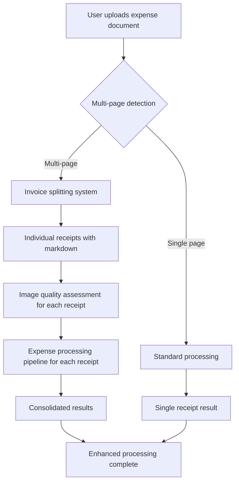

# Enhanced Invoice Splitting Workflow

## Overview

The Enhanced Invoice Splitting Workflow is a new feature that automatically detects multi-page expense documents, splits them into individual receipts, and processes each receipt through the complete expense processing pipeline including image quality assessment.

## Workflow Architecture



## Key Components

### 1. Enhanced Document Processing Service
- **Location**: [`src/services/enhanced-document-processing.service.ts`](src/services/enhanced-document-processing.service.ts)
- **Purpose**: Orchestrates the complete enhanced workflow
- **Key Methods**:
  - `processDocumentWithInvoiceSplitting()`: Main processing method
  - `shouldUseInvoiceSplitting()`: Determines if enhanced processing should be used
  - `cleanupTempFiles()`: Cleans up temporary files after processing

### 2. Invoice Splitter Integration
- **Location**: [`src/modules/invoice-splitter/`](src/modules/invoice-splitter/)
- **Purpose**: Detects and splits multi-page documents into individual receipts
- **Key Features**:
  - LLM-based page analysis
  - PDF splitting into individual receipt files
  - Markdown content extraction for each receipt

### 3. Image Quality Assessment
- **Location**: [`src/agents/image-quality-assessment.agent.ts`](src/agents/image-quality-assessment.agent.ts)
- **Purpose**: Evaluates image quality for each individual receipt
- **Assessment Categories**:
  - Blur detection
  - Contrast assessment
  - Glare identification
  - Water stains
  - Tears or folds
  - Cut-off detection
  - Missing sections
  - Obstructions

### 4. Expense Processing Pipeline
- **Location**: [`src/services/expense-processing.service.ts`](src/services/expense-processing.service.ts)
- **Purpose**: Processes each receipt through the complete pipeline
- **Processing Stages**:
  - File classification
  - Data extraction
  - Issue detection
  - Citation generation
  - LLM-as-judge validation

## API Endpoints

### 1. Standard Processing with Enhanced Option
```http
POST /documents/process
Content-Type: multipart/form-data

{
  "file": <file>,
  "userId": "user_123",
  "country": "Germany",
  "icp": "Global People",
  "documentReader": "textract",
  "useEnhancedProcessing": true
}
```

### 2. Dedicated Enhanced Processing Endpoint
```http
POST /documents/process-enhanced
Content-Type: multipart/form-data

{
  "file": <file>,
  "userId": "user_123",
  "country": "Germany",
  "icp": "Global People",
  "documentReader": "textract"
}
```

## Response Format

### Enhanced Processing Response
```json
{
  "success": true,
  "message": "Enhanced expense document processing job created successfully",
  "data": {
    "jobId": "multi_receipt.pdf_user_123",
    "status": "queued",
    "userId": "user_123",
    "sessionId": "session_user_123_2025-01-15T10-30-00-000Z_abc12345",
    "processingMode": "enhanced-with-splitting"
  }
}
```

### Processing Results Structure
```json
{
  "originalDocument": {
    "filename": "multi_receipt_document.pdf",
    "totalPages": 4,
    "hasMultipleInvoices": true
  },
  "individualReceipts": [
    {
      "receiptId": "receipt_1_abc12345",
      "invoiceNumber": 1,
      "pages": [1],
      "markdown": "# Receipt Content...",
      "pdfPath": "/tmp/invoice-splits/1234567890/invoice_1.pdf",
      "imageQualityAssessment": {
        "overall_quality_score": 8.5,
        "suitable_for_extraction": true,
        "blur_detection": {
          "detected": false,
          "severity_level": "low",
          "confidence_score": 0.95
        }
      },
      "expenseProcessingResult": {
        "classification": {
          "is_expense": true,
          "expense_type": "restaurant",
          "confidence": 0.95
        },
        "extraction": {
          "supplier_name": "Restaurant ABC",
          "amount": 25.50,
          "currency": "EUR",
          "date": "2024-01-15"
        },
        "compliance": {
          "validation_result": {
            "is_valid": true,
            "issues_count": 0,
            "issues": []
          }
        },
        "citations": {
          "supplier_name": {
            "value": "Restaurant ABC",
            "source_text": "Restaurant ABC\nMain Street 123",
            "confidence": 0.98
          }
        }
      },
      "processingTime": 15000
    }
  ],
  "summary": {
    "totalReceipts": 2,
    "successfulProcessing": 2,
    "failedProcessing": 0,
    "totalProcessingTime": 27000,
    "averageQualityScore": 7.85
  },
  "tempDirectory": "/tmp/invoice-splits/1234567890"
}
```

## Configuration

### Environment Variables
```bash
# Enhanced processing settings
USE_ENHANCED_PROCESSING=true
DEFAULT_DOCUMENT_READER=textract  # Better for page detection

# Invoice splitter settings
INVOICE_SPLITTER_TIMEOUT=120000
INVOICE_SPLITTER_MAX_PAGES=50

# Image quality assessment
IMAGE_QUALITY_THRESHOLD=5.0
QUALITY_ASSESSMENT_PROVIDER=bedrock
```

### Multi-page Detection Logic
The system automatically determines whether to use enhanced processing based on:

1. **File Type**: PDFs are automatically considered for enhanced processing
2. **User Override**: `useEnhancedProcessing` parameter can force enhanced mode
3. **File Size**: Large files are more likely to be multi-page
4. **Content Analysis**: Future enhancement could analyze content structure

## Processing Flow Details

### 1. Document Upload and Analysis
```typescript
// 1. User uploads document
const file = uploadedFile;

// 2. System determines processing mode
const shouldUseEnhanced = await enhancedService.shouldUseInvoiceSplitting(file);

// 3. Route to appropriate processor
if (shouldUseEnhanced) {
  return await processDocumentEnhanced(job);
} else {
  return await processDocumentStandard(job);
}
```

### 2. Invoice Splitting Process
```typescript
// 1. Analyze document for invoice boundaries
const splitResult = await invoiceSplitterService.analyzeAndSplitDocument(file, options);

// 2. Extract individual receipts
const { invoices } = splitResult.data;

// 3. Each invoice contains:
// - invoiceNumber: Unique identifier
// - pages: Array of page numbers
// - content: Combined markdown content
// - pdfPath: Path to individual PDF file
```

### 3. Individual Receipt Processing
```typescript
for (const invoice of invoices) {
  // 1. Image quality assessment
  const qualityAssessment = await imageQualityAgent.assessImageQuality(invoice.pdfPath);
  
  // 2. Expense processing pipeline
  const expenseResult = await expenseProcessingService.processExpenseDocument(
    invoice.content,  // markdown content
    filename,
    invoice.pdfPath,  // image path
    country,
    icp,
    complianceData,
    expenseSchema
  );
  
  // 3. Combine results
  individualReceipts.push({
    receiptId: generateReceiptId(),
    invoiceNumber: invoice.invoiceNumber,
    pages: invoice.pages,
    imageQualityAssessment: qualityAssessment,
    expenseProcessingResult: expenseResult,
    processingTime: processingTime
  });
}
```

## Error Handling

### Common Error Scenarios
1. **Invoice Splitting Failure**: Falls back to standard processing
2. **Image Quality Assessment Failure**: Continues with default quality scores
3. **Individual Receipt Processing Failure**: Marks receipt as failed but continues with others
4. **Temporary File Cleanup Failure**: Logs warning but doesn't fail the process

### Error Response Format
```json
{
  "success": false,
  "error": "Enhanced document processing failed: Invoice splitting service unavailable",
  "processingTime": 5000
}
```

## Performance Considerations

### Processing Time
- **Standard Processing**: ~10-30 seconds per document
- **Enhanced Processing**: ~15-45 seconds per receipt (depends on number of receipts)
- **Parallel Processing**: Each receipt is processed independently for better performance

### Resource Usage
- **Memory**: Higher usage due to PDF splitting and multiple concurrent processing
- **Storage**: Temporary files created for each split receipt
- **CPU**: Increased usage for image quality assessment and parallel processing

### Optimization Strategies
1. **Parallel Receipt Processing**: Process multiple receipts concurrently
2. **Efficient Cleanup**: Automatic cleanup of temporary files
3. **Quality Score Caching**: Cache quality assessments for similar images
4. **Smart Detection**: Only use enhanced processing when beneficial

## Testing

### Test Script
Run the comprehensive test script:
```bash
npm run test:enhanced-workflow
# or
npx ts-node test-enhanced-invoice-splitting.ts
```

### Manual Testing
1. **Single Receipt PDF**: Should use standard processing
2. **Multi-Receipt PDF**: Should automatically use enhanced processing
3. **Image Files**: Should use standard processing
4. **Large PDF**: Should use enhanced processing with proper splitting

### Test Data Structure
```
test-data/
├── single-receipt.pdf          # Single receipt document
├── multi-receipt-document.pdf  # Multiple receipts in one document
├── expense-report.pdf          # Expense report with multiple receipts
└── poor-quality-receipt.pdf    # Low quality image for quality assessment testing
```

## Monitoring and Observability

### Langfuse Tracing
- **Main Trace**: Enhanced document processing workflow
- **Sub-traces**: Individual receipt processing
- **Spans**: Invoice splitting, quality assessment, expense processing
- **Metadata**: Processing times, quality scores, success rates

### Metrics to Monitor
1. **Processing Success Rate**: Percentage of successfully processed receipts
2. **Average Quality Score**: Overall image quality across all receipts
3. **Processing Time Distribution**: Time taken for different stages
4. **Error Rates**: Frequency of different error types
5. **Resource Usage**: Memory and CPU utilization during processing

### Logging
```typescript
// Key log messages to monitor
this.logger.log(`🚀 Starting enhanced processing with invoice splitting for: ${filename}`);
this.logger.log(`📊 Document analysis complete: ${totalInvoices} invoices found in ${totalPages} pages`);
this.logger.log(`🧾 Processing receipt ${i + 1}/${totalReceipts}: Invoice ${invoiceNumber}`);
this.logger.log(`🔍 Assessing image quality for receipt ${receiptId}`);
this.logger.log(`⚙️ Processing receipt ${receiptId} through expense pipeline`);
this.logger.log(`✅ Receipt ${receiptId} processed successfully in ${processingTime}ms`);
this.logger.log(`💾 Saving ${receipts.length} individual receipt results for ${originalFilename}`);
this.logger.log(`   ✅ Saved receipt ${invoiceNumber} result: ${receiptFilePath}`);
this.logger.log(`   📋 Saved enhanced processing summary: ${summaryFilePath}`);
this.logger.log(`🎯 Enhanced document processing complete: ${successfulProcessing}/${totalReceipts} receipts processed successfully`);
```

## Future Enhancements

### Planned Features
1. **Smart Content Analysis**: Better detection of multi-receipt documents
2. **Receipt Categorization**: Automatic categorization of receipt types
3. **Batch Processing**: Process multiple documents simultaneously
4. **Quality Improvement Suggestions**: Recommendations for better image quality
5. **Receipt Deduplication**: Detect and handle duplicate receipts
6. **OCR Confidence Scoring**: Enhanced text extraction confidence metrics

### Integration Opportunities
1. **Mobile App Integration**: Direct camera capture with quality guidance
2. **Email Processing**: Extract receipts from email attachments
3. **Cloud Storage Integration**: Process documents from cloud storage services
4. **Accounting Software Integration**: Direct export to accounting systems

## Troubleshooting

### Common Issues

#### 1. Invoice Splitting Fails
**Symptoms**: All pages treated as single receipt
**Solutions**:
- Check document reader configuration (prefer textract for splitting)
- Verify PDF is not password protected
- Ensure sufficient memory for PDF processing

#### 2. Image Quality Assessment Errors
**Symptoms**: Quality scores always 0 or assessment fails
**Solutions**:
- Verify Bedrock/Anthropic API credentials
- Check image file accessibility
- Ensure sufficient API rate limits

#### 3. Individual Receipt Processing Fails
**Symptoms**: Some receipts marked as failed
**Solutions**:
- Check expense processing service configuration
- Verify compliance data availability
- Review individual error messages in logs

#### 4. Temporary File Cleanup Issues
**Symptoms**: Disk space usage increases over time
**Solutions**:
- Check file system permissions
- Verify cleanup service is running
- Manually clean temporary directories if needed

### Debug Mode
Enable detailed logging:
```bash
export LOG_LEVEL=debug
export ENHANCED_PROCESSING_DEBUG=true
```

## Security Considerations

### Data Protection
1. **Temporary Files**: Automatically cleaned up after processing
2. **File Access**: Restricted to processing service only
3. **API Security**: Standard authentication and authorization
4. **Data Retention**: Configurable retention policies for processed data

### Privacy
1. **User Data**: Processed according to privacy policies
2. **Receipt Content**: Encrypted during processing
3. **Audit Trail**: Complete processing history maintained
4. **Data Anonymization**: Option to anonymize sensitive data

## Support and Maintenance

### Monitoring Checklist
- [ ] Processing success rates above 95%
- [ ] Average processing time within acceptable limits
- [ ] Error rates below 5%
- [ ] Temporary file cleanup functioning
- [ ] API response times acceptable
- [ ] Resource usage within limits

### Regular Maintenance
1. **Weekly**: Review error logs and success rates
2. **Monthly**: Analyze performance trends and optimization opportunities
3. **Quarterly**: Update compliance data and expense schemas
4. **Annually**: Review and update processing algorithms

For technical support or questions about the Enhanced Invoice Splitting Workflow, please refer to the development team or create an issue in the project repository.