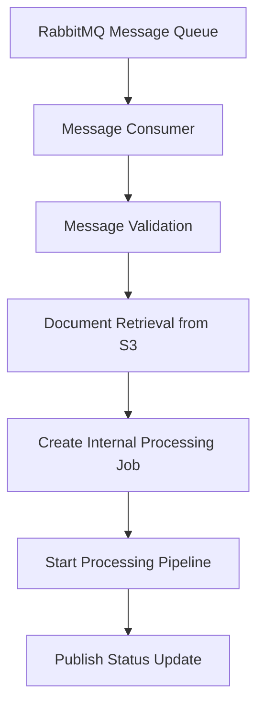
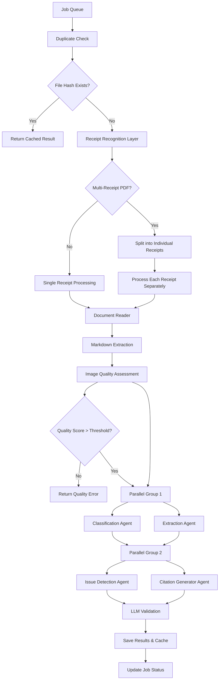
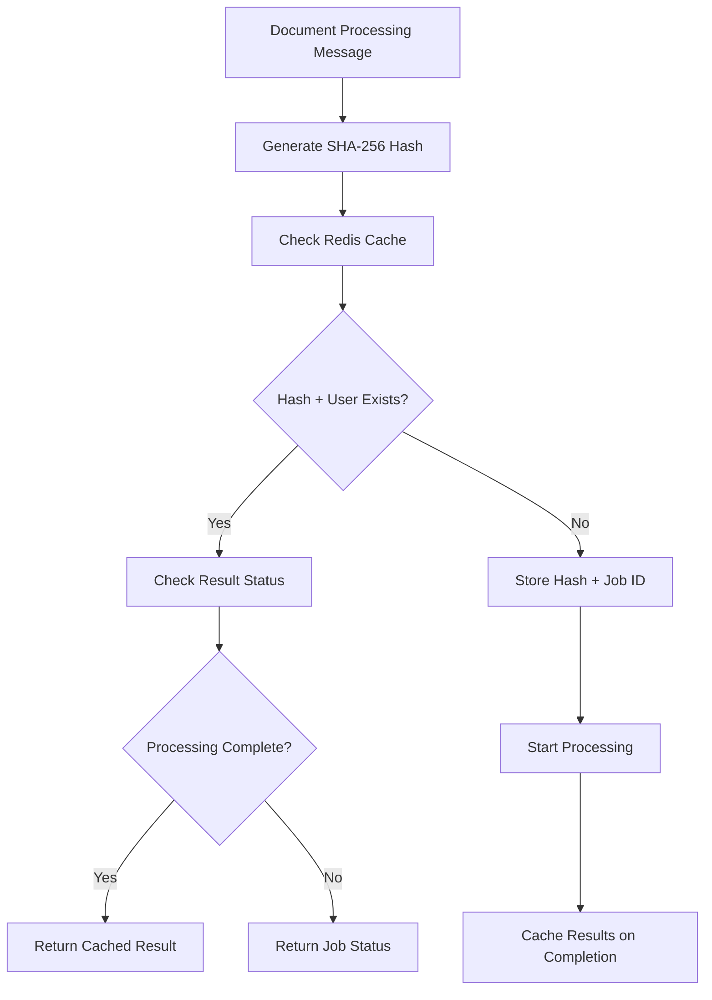
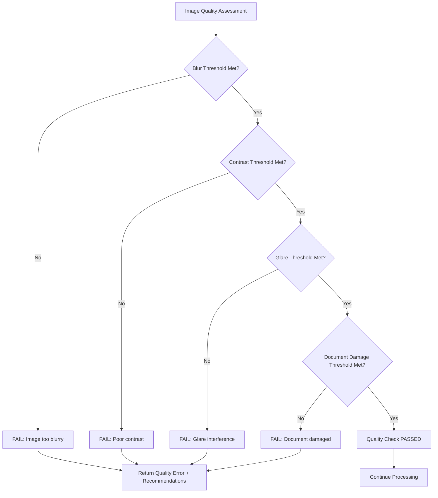
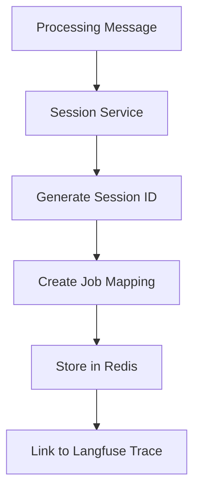
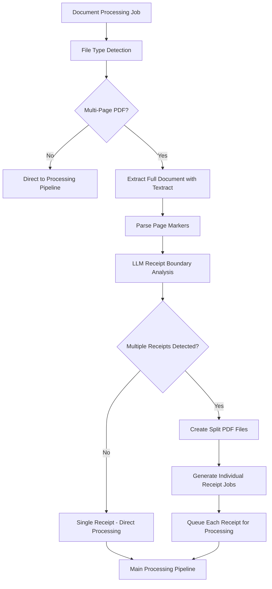
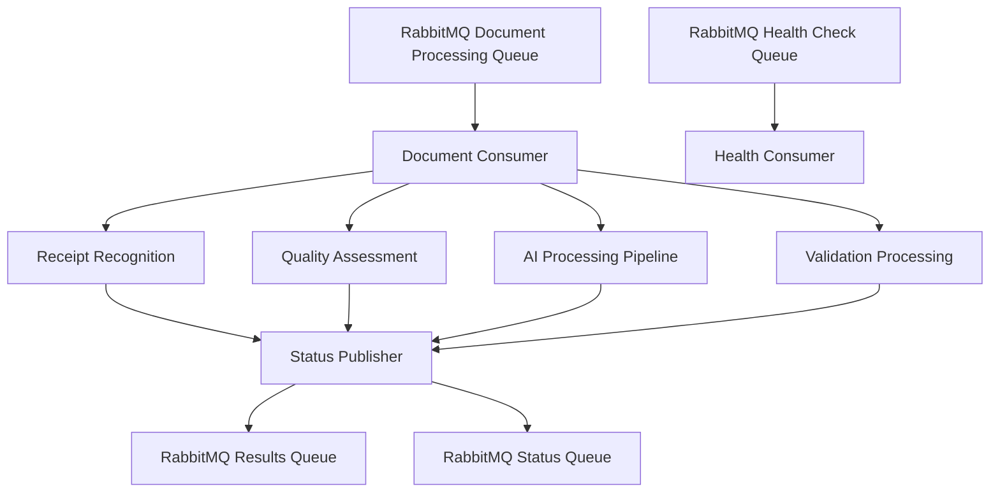

# MVP Architecture Plan: Expenses AI for Papaya

## Executive Summary

This document outlines the MVP architecture for a scalable, production-ready AI-powered expense processing service for Expenses AI. The system processes expense documents using multi-agent AI workflows, provides compliance validation, and offers real-time processing status tracking.

## Table of Contents

1. [System Overview](#system-overview)
2. [Architecture Components](#architecture-components)
3. [Technology Stack](#technology-stack)
4. [Data Flow Architecture](#data-flow-architecture)
5. [Scalability Design](#scalability-design)
6. [Security & Compliance](#security--compliance)
7. [Monitoring & Observability](#monitoring--observability)
8. [Deployment Strategy](#deployment-strategy)
9. [Event-Driven Architecture Design](#event-driven-architecture-design)
10. [Performance Requirements](#performance-requirements)
11. [Disaster Recovery](#disaster-recovery)
12. [Cost Optimization](#cost-optimization)

## System Overview

### Core Functionality
- **Event-Driven Processing**: RabbitMQ-based message consumption for document processing requests
- **Receipt Recognition**: Intelligent multi-receipt PDF splitting and individual receipt processing
- **Document Processing**: Multi-format expense document ingestion (PDF, images)
- **AI-Powered Analysis**: Multi-agent workflow for classification, extraction, and validation
- **Compliance Checking**: Country-specific expense policy validation
- **Asynchronous Processing**: Queue-based job processing with status tracking
- **Quality Assessment**: Image quality analysis and recommendations

### Key Features
- Multi-tenant user management with session tracking
- Parallel processing with two-stage agent execution
- LLM-as-judge validation system
- Comprehensive audit trails via Langfuse
- RabbitMQ event-driven architecture
- Health monitoring and metrics collection

## Architecture Components

### 1. Message Broker Layer
```
┌─────────────────────────────────────────┐
│            RabbitMQ Broker              │
│          (External System)              │
│                                         │
│  ┌─────────────────────────────────────┐ │
│  │         Message Queues              │ │
│  │                                     │ │
│  │ - document.processing.queue         │ │
│  │ - document.results.queue            │ │
│  │ - document.status.queue             │ │
│  │ - system.health.queue               │ │
│  └─────────────────────────────────────┘ │
└─────────────────────────────────────────┘
```

### 2. Application Layer
```
┌─────────────────────────────────────────┐
│         NestJS Application              │
│                                         │
│  ┌─────────────┐  ┌─────────────────┐   │
│  │ RabbitMQ    │  │    Services     │   │
│  │ Consumers   │  │                 │   │
│  │             │  │ - Processing    │   │
│  │ - Document  │  │ - User Session  │   │
│  │ - Health    │  │ - Langfuse      │   │
│  │ - Validation│  │ - Dataset Mgmt  │   │
│  │ - Results   │  │ - Message Pub   │   │
│  └─────────────┘  └─────────────────┘   │
│                                         │
│  ┌─────────────────────────────────────┐ │
│  │      Receipt Recognition Layer      │ │
│  │                                     │ │
│  │ - Multi-Receipt PDF Detection      │ │
│  │ - Document Splitting Service       │ │
│  │ - Invoice Splitter Agent           │ │
│  │ - Page Boundary Analysis           │ │
│  └─────────────────────────────────────┘ │
│                                         │
│  ┌─────────────────────────────────────┐ │
│  │         AI Agent Layer              │ │
│  │                                     │ │
│  │ - File Classification Agent        │ │
│  │ - Data Extraction Agent            │ │
│  │ - Issue Detection Agent            │ │
│  │ - Citation Generator Agent         │ │
│  │ - Image Quality Assessment Agent   │ │
│  └─────────────────────────────────────┘ │
│                                         │
│  ┌─────────────────────────────────────┐ │
│  │         Validation Layer            │ │
│  │                                     │ │
│  │ - LLM-as-Judge Validation          │ │
│  └─────────────────────────────────────┘ │
└─────────────────────────────────────────┘
```

### 3. Processing Layer
```
┌─────────────────────────────────────────┐
│         Job Queue System                │
│                                         │
│  ┌─────────────┐  ┌─────────────────┐   │
│  │   BullMQ    │  │     Redis       │   │
│  │             │  │                 │   │
│  │ - Job Queue │  │ - Queue Storage │   │
│  │ - Scheduler │  │ - Session Cache │   │
│  │ - Retry     │  │ - Rate Limiting │   │
│  │ - Metrics   │  │ - Pub/Sub       │   │
│  └─────────────┘  └─────────────────┘   │
└─────────────────────────────────────────┘
```

### 4. AI Services Layer
```
┌─────────────────────────────────────────┐
│           AI Provider Layer             │
│                                         │
│  ┌─────────────┐  ┌─────────────────┐   │
│  │AWS Bedrock  │  │   Anthropic     │   │
│  │             │  │   (Fallback)    │   │
│  │ - Nova Pro  │  │ - Claude 3.5    │   │
│  │ - Nova Lite │  │ - Sonnet        │   │
│  │ - Claude 3.5│  │                 │   │
│  └─────────────┘  └─────────────────┘   │
│                                         │
│  ┌─────────────────────────────────────┐ │
│  │      Document Processing            │ │
│  │                                     │ │
│  │ - AWS Textract                     │ │
│  └─────────────────────────────────────┘ │
└─────────────────────────────────────────┘
```

### 5. Data Layer
```
┌─────────────────────────────────────────┐
│            Storage Layer                │
│                                         │
│  ┌─────────────┐  ┌─────────────────┐   │
│  │File Storage │  │   Databases     │   │
│  │             │  │                 │   │
│  │ - S3 Bucket │  │ - AWS Aurora    │   │
│  │ - Local FS  │  │   (User Data)   │   │
│  │ - CDN       │  │ - Redis         │   │
│  │             │  │   (Cache/Queue) │   │
│  └─────────────┘  └─────────────────┘   │
└─────────────────────────────────────────┘
```

### 6. Observability Layer
```
┌─────────────────────────────────────────┐
│        Monitoring & Logging             │
│                                         │
│  ┌─────────────┐  ┌─────────────────┐   │
│  │  Langfuse   │  │   Monitoring    │   │
│  │             │  │(Needs Approval) │   │
│  │ - LLM Traces│  │ - Prometheus    │   │
│  │ - Prompts   │  │ - Grafana       │   │
│  │ - Analytics │  │ - AlertManager  │   │
│  │ - Debugging │  │                 │   │
│  └─────────────┘  └─────────────────┘   │
└─────────────────────────────────────────┘
```

## Technology Stack

### Backend Framework
- **NestJS**: Enterprise-grade Node.js framework
- **TypeScript**: Type-safe development
- **Node.js**: Runtime environment for message processing

### AI & ML Services
- **AWS Bedrock**: Primary LLM provider (Nova Pro/Lite, Claude 3.5)
- **Anthropic Claude**: Fallback LLM provider
- **AWS Textract**: Document OCR and analysis

### Message Broker & Caching
- **RabbitMQ**: Message broker for event-driven processing (external)
- **amqplib**: RabbitMQ client library for Node.js
- **BullMQ**: Internal job queue system
- **Redis**: In-memory data store and cache
- **IORedis**: Redis client with clustering support

### Storage
- **AWS S3**: Object storage for documents and split receipt files
- **AWS Aurora Serverless**: Auto-scaling relational database with:
  - Automatic scaling based on demand
  - Multi-AZ deployment for high availability
  - Automated backups and point-in-time recovery
  - Enhanced security with encryption at rest and in transit

### Monitoring & Observability
- **Langfuse**: LLM observability and prompt management
- **Prometheus**: Metrics collection
- **Grafana**: Visualization and dashboards

### Development & Deployment
- **Docker**: Containerization
- **Docker Compose**: Local development orchestration
- **AWS ECS/EKS**: Container orchestration
- **GitHub Actions**: CI/CD pipeline

## Data Flow Architecture

### 1. Message Consumption Flow


### 2. Processing Pipeline


### 3. Duplicate Detection Flow


### 4. Quality Gate Decision Tree


### 5. Session Management


### 7. Receipt Recognition Layer
```
┌─────────────────────────────────────────┐
│        Receipt Recognition Layer        │
│                                         │
│  ┌─────────────┐  ┌─────────────────┐   │
│  │   PDF       │  │   Intelligence  │   │
│  │ Processing  │  │    Engine       │   │
│  │             │  │                 │   │
│  │ - Multi-PDF │  │ - LLM Analysis  │   │
│  │   Detection │  │ - Page Grouping │   │
│  │ - Page      │  │ - Confidence    │   │
│  │   Splitting │  │   Scoring       │   │
│  │ - File      │  │ - Boundary      │   │
│  │   Creation  │  │   Detection     │   │
│  └─────────────┘  └─────────────────┘   │
│                                         │
│  ┌─────────────────────────────────────┐ │
│  │         Document Processing         │ │
│  │                                     │ │
│  │ - AWS Textract Integration         │ │
│  │ - Markdown Page Parsing            │ │
│  │ - Receipt Boundary Analysis        │ │
│  │ - Multi-Page Receipt Handling      │ │
│  └─────────────────────────────────────┘ │
└─────────────────────────────────────────┘
```

#### Receipt Recognition Features

**Multi-Receipt PDF Detection**: The system automatically analyzes uploaded PDF files to determine if they contain multiple individual receipts. Using AWS Textract for document extraction and LLM-powered analysis, the system identifies receipt boundaries based on transaction-level identifiers rather than document container headers.

**Intelligent Splitting Logic**: The Receipt Recognition layer implements sophisticated logic to distinguish between document containers (expense reports, compilations) and individual transactions. It focuses on transaction-level identifiers such as receipt numbers, transaction times, totals, and payment methods to accurately separate individual receipts.

**Page Boundary Analysis**: The system handles complex scenarios including:
- Multiple receipts on a single page
- Single receipts spanning multiple pages
- Mixed document types within the same PDF
- Expense report containers with multiple individual receipts

**Quality and Confidence Scoring**: Each detected receipt boundary includes confidence scoring and detailed reasoning to ensure accurate splitting. The system provides transparency in its decision-making process and allows for manual review of low-confidence splits.

**Bypass Logic for Single Receipts**: Single-page files (images, single-page PDFs) automatically bypass the splitting process and proceed directly to the main processing pipeline, optimizing performance for simple cases.

#### Receipt Recognition Flow


#### Integration with Existing Pipeline

The Receipt Recognition layer seamlessly integrates with the existing expense processing pipeline:

**Pre-Processing Stage**: Receipt recognition occurs immediately after duplicate detection and before quality assessment, ensuring that each individual receipt is processed independently with its own quality validation.

**Job Queue Integration**: When multiple receipts are detected, the system creates separate processing jobs for each individual receipt, allowing for parallel processing and independent status tracking.

**Result Aggregation**: Results from split receipts can be aggregated at the user session level while maintaining individual receipt traceability and audit trails.

**Error Handling**: If receipt splitting fails, the system gracefully falls back to processing the entire document as a single unit, ensuring no processing failures due to splitting issues.

### 8. RabbitMQ Integration Layer
```
┌─────────────────────────────────────────┐
│        RabbitMQ Integration             │
│                                         │
│  ┌─────────────┐  ┌─────────────────┐   │
│  │  Consumer   │  │    Publisher    │   │
│  │  Services   │  │    Services     │   │
│  │             │  │                 │   │
│  │ - Document  │  │ - Status Updates│   │
│  │   Processing│  │ - Results       │   │
│  │ - Validation│  │ - Error Reports │   │
│  │ - Health    │  │ - Progress      │   │
│  │   Checks    │  │   Notifications │   │
│  └─────────────┘  └─────────────────┘   │
│                                         │
│  ┌─────────────────────────────────────┐ │
│  │         Message Handling            │ │
│  │                                     │ │
│  │ - Message Validation & Parsing     │ │
│  │ - Dead Letter Queue Management     │ │
│  │ - Retry Logic & Exponential Backoff│ │
│  │ - Consumer Scaling & Load Balancing│ │
│  └─────────────────────────────────────┘ │
└─────────────────────────────────────────┘
```

#### RabbitMQ Integration Features

**Message Consumer Architecture**: The system implements multiple specialized consumers for different message types. Document processing consumers handle expense document analysis requests, validation consumers process compliance verification requests, and health check consumers monitor system status. Each consumer type can be scaled independently based on message volume and processing requirements.

**Queue Configuration**: The system uses durable queues with appropriate routing keys and exchange configurations. Document processing messages are routed through topic exchanges to enable flexible message routing based on document type, country, and processing requirements. Dead letter queues capture failed messages for manual review and reprocessing.

**Message Acknowledgment**: All consumers implement manual message acknowledgment to ensure reliable processing. Messages are acknowledged only after successful processing completion, preventing message loss during system failures or processing errors. Failed messages are rejected and routed to dead letter queues for investigation.

**Consumer Scaling**: The system supports horizontal scaling of consumer instances based on queue depth and processing load. Multiple consumer instances can process messages concurrently, with automatic load balancing across available consumers. Consumer instances can be added or removed dynamically based on system demand.

**Error Handling and Retry Logic**: Failed message processing triggers intelligent retry mechanisms with exponential backoff. Transient errors (network issues, temporary service unavailability) are retried automatically, while permanent errors (invalid message format, missing required fields) are immediately routed to dead letter queues.

#### Message Flow Architecture


#### Integration with Existing Pipeline

**Message-Driven Processing Integration**: RabbitMQ consumers trigger the processing pipeline by consuming messages from designated queues. Document processing messages are validated, parsed, and passed to the Receipt Recognition layer, followed by quality assessment and AI processing stages.

**Status Publishing**: Throughout the processing pipeline, status updates are published to designated result queues. External systems can consume these status messages to track processing progress, handle completion notifications, and respond to error conditions.

**Result Distribution**: Completed processing results are published to result queues with comprehensive processing outcomes, quality scores, and AI-generated insights. Results are made available for consumption through designated result queues.


## Scalability Design

### Horizontal Scaling Strategy

#### 1. Application Layer Scaling
```yaml
# Kubernetes Deployment Example
apiVersion: apps/v1
kind: Deployment
metadata:
  name: expense-processing-api
spec:
  replicas: 3  # Start with 3, auto-scale to 10
  selector:
    matchLabels:
## Parallel Processing Architecture

### Two-Stage Parallel Execution
The system implements a sophisticated two-stage parallel processing architecture that maximizes throughput while maintaining data dependencies:

**Parallel Group 1 - Independent Processing**: The first stage executes two agents simultaneously as they can operate independently on the source document:

- **File Classification Agent**: Determines document type and expense category
- **Data Extraction Agent**: Extracts structured data from the document content

**Parallel Group 2 - Dependent Processing**: The second stage runs two agents concurrently, both utilizing results from Group 1:
- **Issue Detection Agent**: Analyzes compliance issues using policy rules, extracted data and classification results
- **Citation Generator Agent**: Creates citations and references using extracted data and document content

**Performance Benefits**: The two-stage approach ensures data dependencies are respected while maximizing concurrent execution.

**Resource Optimization**: Each parallel group is designed to utilize available CPU cores efficiently while managing memory usage and API rate limits for external AI services.
      app: expense-processing-api
  template:
    spec:
      containers:
      - name: api
        image: expense-processing:latest
        resources:
          requests:
            memory: "512Mi"
            cpu: "250m"
          limits:
            memory: "1Gi"
            cpu: "500m"
```

#### 2. Queue Processing Scaling
- **Multiple Worker Instances**: Scale BullMQ workers independently
- **Queue Partitioning**: Separate queues by priority/type
- **Concurrency Control**: Configurable per-worker concurrency

#### 3. Database Scaling
- **Aurora Serverless**: Auto-scaling compute capacity based on demand
- **Aurora Read Replicas**: Multi-AZ read replicas for query scaling
- **Connection Pooling**: RDS Proxy for connection management
- **Redis Clustering**: Redis Cluster for cache scaling

### Vertical Scaling Considerations
- **Memory**: 2-8GB per instance based on document volume
- **CPU**: 2-8 cores for AI processing workloads
- **Storage**: SSD for temporary files, S3 for permanent storage

### Auto-scaling Triggers
```yaml
# HPA Configuration
apiVersion: autoscaling/v2
kind: HorizontalPodAutoscaler
metadata:
  name: expense-processing-hpa
spec:
  scaleTargetRef:
    apiVersion: apps/v1
    kind: Deployment
    name: expense-processing-api
  minReplicas: 2
  maxReplicas: 10
  metrics:
  - type: Resource
    resource:
      name: cpu
      target:
        type: Utilization
        averageUtilization: 70
  - type: Resource
    resource:
      name: memory
      target:
        type: Utilization
        averageUtilization: 80
```

## Security & Compliance

### 1. Data Protection
- **Encryption at Rest**: AES-256 for stored documents
- **Encryption in Transit**: TLS 1.3 for all communications
- **PII Handling**: Automatic detection and masking
- **Data Retention**: Configurable retention policies
- **Duplicate Prevention**: SHA-256 file hashing with Redis cache
- **File Integrity**: Checksum validation on upload and processing
- **Cache Security**: Encrypted Redis cache with TTL expiration

### 2. Compliance Features
- **GDPR Compliance**: Data subject rights implementation
- **SOC 2**: Security controls and audit trails
- **HIPAA Ready**: Healthcare data handling capabilities
- **Audit Logging**: Comprehensive activity logging

## Monitoring & Observability

### 1. Application Metrics
```typescript
// Enhanced metrics collection with receipt recognition, quality and duplicate tracking
interface ProcessingMetrics {
  totalJobs: number;
  completedJobs: number;
  failedJobs: number;
  duplicateJobs: number;
  qualityFailures: number;
  timeoutFailures: number;
  receiptSplittingJobs: number;
  averageReceiptsPerDocument: number;
  averageProcessingTime: number;
  queueHealth: QueueHealthMetrics;
}

// Quality gate metrics
interface QualityMetrics {
  blurFailures: number;
  contrastFailures: number;
  glareFailures: number;
  tearFailures: number;
  obstructionFailures: number;
  qualityPassRate: number;
}

// Receipt recognition metrics
interface ReceiptRecognitionMetrics {
  totalMultiReceiptDocuments: number;
  averageReceiptsPerDocument: number;
  splittingSuccessRate: number;
  splittingConfidenceScore: number;
  averageSplittingTime: number;
}

// Duplicate detection metrics
interface DuplicateMetrics {
  totalDuplicatesDetected: number;
  cacheHitRate: number;
  duplicatesByUser: Record<string, number>;
  averageCacheRetrievalTime: number;
}

// Performance tracking
interface PerformanceMetrics {
  responseTime: number;
  throughput: number;
  errorRate: number;
  cpuUsage: number;
  memoryUsage: number;
}
```

### 2. Health Checks
The system implements multi-layered health monitoring to ensure reliable operation:

**Liveness Checks**: Verify that the application is running and responsive. These lightweight checks confirm basic application functionality and return system uptime information. Kubernetes uses these checks to determine if a pod should be restarted.

**Readiness Checks**: Perform comprehensive validation of all system dependencies before accepting traffic. This includes:
- Database connectivity and query response times
- Redis cache availability and performance
- AI service provider accessibility and response validation
- File storage system availability and write permissions

**Dependency Monitoring**: Each external dependency is monitored independently with specific timeout thresholds. If any critical dependency fails, the system gracefully degrades service or returns appropriate error responses rather than failing silently.

### 3. Alerting Strategy
The monitoring system implements intelligent alerting to ensure rapid response to operational issues:

**Error Rate Monitoring**: Alerts trigger when message processing error rates exceed 10% over a 5-minute period, indicating potential system issues requiring immediate attention. These critical alerts notify on-call engineers within 2 minutes of detection.

**Queue Health Monitoring**: Warning alerts activate when job queues exceed 100 waiting jobs for more than 5 minutes, suggesting processing bottlenecks or resource constraints that may require scaling intervention.

**Quality Gate Alerts**: Monitor image quality failure rates and alert when quality rejections exceed 30% over 5 minutes, indicating potential issues with document submission guidelines or quality threshold calibration.

**Performance Degradation**: Track response time increases, memory usage spikes, and CPU utilization patterns to predict and prevent system overload before it impacts users.

### 4. Distributed Tracing
- **Langfuse Integration**: LLM-specific tracing and analytics
- **OpenTelemetry**: Standard distributed tracing
- **Correlation IDs**: Request tracking across services

## Deployment Strategy

### 1. Environment Strategy
```
Development → Staging → Production
     ↓           ↓          ↓
   Local      AWS Dev    AWS Prod
   Docker     ECS/EKS    ECS/EKS
```

### 2. Infrastructure as Code
All infrastructure is defined and managed through code to ensure consistency, repeatability, and version control:

**Terraform Configuration**: Infrastructure components are defined using Terraform, enabling automated provisioning of AWS ECS clusters, services, load balancers, and networking components. Each environment (development, staging, production) uses parameterized configurations to maintain consistency while allowing environment-specific customizations.

**Container Orchestration**: ECS services are configured with appropriate resource allocation, health checks, and deployment strategies. The system supports rolling deployments with zero downtime by maintaining minimum healthy instance counts during updates.

**Environment Management**: Infrastructure code includes environment-specific variables for scaling parameters, resource limits, and configuration values. This approach ensures that infrastructure changes are tested in lower environments before production deployment.

### 3. CI/CD Pipeline
The deployment pipeline ensures code quality and reliable releases through automated testing and deployment:

**Automated Testing**: Every code change triggers comprehensive testing including unit tests, integration tests, and end-to-end testing. The pipeline prevents deployment of code that fails any test suite, ensuring quality gates are maintained.

**Container Building**: Successful tests trigger automated Docker image building with unique tags based on Git commit hashes. Images are pushed to Amazon ECR (Elastic Container Registry) for secure storage and distribution.

**Progressive Deployment**: The system supports multiple deployment strategies including blue-green deployments and rolling updates. Production deployments occur only after successful testing and staging environment validation.

**Rollback Capabilities**: Each deployment maintains previous versions for rapid rollback if issues are detected. Automated health checks during deployment can trigger automatic rollbacks if service health degrades.

### 4. Blue-Green Deployment
The system implements blue-green deployment strategy for zero-downtime updates and rapid rollback capabilities:

**Dual Environment Strategy**: Maintains two identical production environments (blue and green) where one serves live traffic while the other remains idle or serves as a staging environment for the next release.

**Traffic Switching**: New deployments are first deployed to the inactive environment, thoroughly tested, and then traffic is switched over instantly. This approach eliminates downtime and provides immediate rollback capability.

**Automated Validation**: Before traffic switching, automated tests validate the new deployment including health checks, performance benchmarks, and functional testing. Manual approval gates can be configured for critical releases.

**Gradual Rollout**: The system supports gradual traffic shifting, allowing a percentage of traffic to be routed to the new version while monitoring for issues before full cutover.

## Event-Driven Architecture Design

### 1. RabbitMQ Message-Based Processing
The system operates entirely through RabbitMQ message consumption for event-driven document processing:

**Document Processing Messages**: The system consumes document processing requests from designated RabbitMQ queues. Each message contains document metadata, file location (S3 path or base64 encoded content), processing parameters, and user context. The system generates a SHA-256 hash for duplicate detection and validates message structure before processing.

**Message Validation**: All incoming messages undergo strict validation to ensure data integrity and prevent malformed requests. Required fields include country, ICP (Internal Control Policy), document type, and user identification. Optional parameters support document reader selection, quality thresholds, and timeout configurations.

**Status Broadcasting**: Processing status updates are published to dedicated result queues, enabling real-time progress tracking. Status messages include job identification, current processing stage, completion percentages, error categorization (TIMEOUT_ERROR, QUALITY_ERROR, DUPLICATE_ERROR, PROCESSING_ERROR), and detailed progress information.

**Results Publishing**: Completed processing results are published to result queues with comprehensive outcomes including quality scores, duplicate indicators, processing metrics, confidence scores for AI-generated insights, and quality assessments for transparency.

**Validation Processing**: Post-processing verification is handled within the document consumer using LLM-as-judge techniques for additional confidence scoring and compliance verification.

**Message Structure**: All messages follow standardized JSON schemas with required fields (messageId, timestamp, userId, documentId, country, ICP) and optional parameters (documentReader, qualityThresholds, timeoutSettings). Response messages include comprehensive metadata about processing status, quality metrics, and performance indicators.

### 2. RabbitMQ Queue Architecture
The system implements a comprehensive queue-based communication pattern for all processing operations:

**Queue Topology**: The system consumes from specialized queues including document processing and health checks. Each queue is configured with appropriate durability, routing, and dead letter queue settings for reliable message handling.

**Message Routing**: Messages are routed based on content type and processing requirements. Document processing messages are distributed across multiple consumer instances for load balancing, while validation requests are handled by specialized validation consumers.

**Progress Publishing**: As documents move through the processing pipeline (receipt recognition, quality assessment, classification, extraction, compliance checking, citation generation), the system publishes progress updates to designated status and result queues with detailed stage information and completion percentages.

**Error Handling**: Processing failures, quality gate rejections, and timeout errors are published to the status queue with specific categorization and actionable recommendations. Dead letter queues capture messages that cannot be processed after retry attempts.

**Consumer Management**: The system implements multiple consumer instances with configurable concurrency levels, automatic reconnection, and graceful shutdown handling. Message acknowledgment ensures reliable processing and prevents message loss during system failures.

**Event Publishing**: The system publishes structured events containing job identification, current processing stage, completion percentages, error details, and comprehensive metadata to designated status and result queues for consumption.

### 3. Message Schema Documentation
```typescript
// RabbitMQ Message Schemas
interface DocumentProcessingMessage {
  messageId: string;
  timestamp: string;
  userId: string;
  documentId: string;
  country: string;
  icp: string;
  documentType: 'pdf' | 'image';
  fileLocation: {
    s3Bucket?: string;
    s3Key?: string;
    base64Content?: string;
  };
  processingOptions?: {
    documentReader?: 'textract';
    qualityThresholds?: QualityThresholds;
    timeoutSeconds?: number;
    bypassQualityCheck?: boolean;
  };
  metadata?: Record<string, any>;
}

interface ProcessingStatusMessage {
  messageId: string;
  correlationId: string;
  timestamp: string;
  userId: string;
  documentId: string;
  status: 'PROCESSING' | 'COMPLETED' | 'FAILED';
  stage: string;
  progress: number;
  error?: {
    type: 'TIMEOUT_ERROR' | 'QUALITY_ERROR' | 'PROCESSING_ERROR';
    message: string;
    details?: any;
  };
  results?: ProcessingResults;
}

interface ValidationMessage {
  messageId: string;
  timestamp: string;
  userId: string;
  documentId: string;
  validationType: 'compliance' | 'quality' | 'accuracy';
  processingResults: ProcessingResults;
  validationCriteria?: Record<string, any>;
}
```

## Performance Requirements

### 1. Message Processing Time Targets
```
Message Type                Target      Acceptable
─────────────────────────────────────────────────
Message Consumption         < 50ms      < 100ms
Message Validation          < 100ms     < 200ms
Status Publishing           < 50ms      < 100ms
Processing Pipeline         < 30s       < 60s
Result Publishing           < 100ms     < 200ms
```

### 2. Throughput Requirements
```
Metric                      Target      Peak
─────────────────────────────────────────────
Documents/hour              1,000       2,500
Concurrent consumers        10          25
Messages/second             50          125
Queue processing rate       10 jobs/s   25 jobs/s
Message publishing rate     100 msg/s   250 msg/s
```

### 3. Enhanced Processing Logic

### 1. Duplicate Detection Service
The duplicate detection service implements intelligent file deduplication to optimize processing resources and improve response times:

**Hash-Based Detection**: Each uploaded file is processed through SHA-256 hashing to create a unique fingerprint. This cryptographic hash ensures that even minor file modifications result in different hashes, while identical files always produce the same hash regardless of filename or upload time.

**User-Scoped Caching**: Duplicate detection operates within user boundaries, meaning files are only considered duplicates within the same user's context. This approach maintains data privacy while enabling efficient caching. The cache key combines the file hash with the user identifier to create unique storage keys.

**Cache Management**: The system maintains a Redis-based cache with configurable TTL (Time To Live) settings, defaulting to 24 hours. This balance ensures recent duplicates are caught while preventing indefinite cache growth. Cache entries include the original job ID, processing results, and timestamp information.

**Immediate Response**: When duplicates are detected, the system immediately returns cached results without initiating new processing jobs, significantly reducing response times and computational overhead.

### 2. Quality Gate Service
The quality gate service implements comprehensive image quality validation to ensure optimal processing results:

**Multi-Dimensional Quality Assessment**: The service evaluates multiple quality dimensions including blur detection, contrast assessment, glare identification, and physical document damage (tears, folds). Each dimension has configurable thresholds that can be adjusted based on processing requirements and accuracy needs.

**Configurable Thresholds**: Quality standards are environment-configurable, allowing different thresholds for development, staging, and production environments. Default thresholds include blur detection at 0.7 confidence, contrast assessment at 0.6, and glare detection at medium severity level.

**Threshold-Based Assessment**: The service evaluates each quality dimension against individual configurable thresholds with specific score and severity criteria. Each quality check (blur, contrast, glare, document damage) has its own threshold settings. If any image fails to meet any of the configured thresholds, the system immediately flags a quality error and terminates processing.

**Early Termination**: When quality issues are detected that fall below thresholds, processing is immediately terminated with specific error messages and recommendations. This prevents wasted computational resources on documents that cannot be accurately processed.

**Detailed Feedback**: Quality failures include specific issue descriptions and actionable recommendations, such as "Please upload a clearer image with better focus" for blur issues or "Please upload an image without glare or reflections" for glare problems.

### 3. Enhanced Job Processing with Timeouts and Retry Logic
The enhanced job processor implements comprehensive timeout management and intelligent retry strategies:

**Timeout Management**: All processing jobs are subject to a configurable timeout limit, defaulting to 60 seconds (1 minute). The system uses Promise.race() to compete the processing operation against a timeout promise, ensuring that no job can consume resources indefinitely. When timeouts occur, processing is immediately terminated with appropriate error responses.

**Processing Pipeline**: The job processor follows a structured execution flow:
1. **Duplicate Detection**: First checks if the file has been processed before using SHA-256 hashing and user-scoped caching
2. **Quality Gate Validation**: Assesses image quality against configurable thresholds for blur, contrast, glare, and document damage
3. **Core Processing**: Executes the full AI processing pipeline with parallel agent execution for classification, extraction, and compliance checking
4. **Result Caching**: Stores successful results for future duplicate detection with appropriate TTL settings

**Error Classification**: The system defines specific error types for different failure scenarios:
- **JobTimeoutError**: Triggered when processing exceeds the 60-second limit, includes timeout duration information
- **QualityGateError**: Raised when image quality falls below acceptable thresholds, includes detailed quality assessment results
- **ProcessingError**: General processing failures with wrapped original error context for debugging

**Graceful Degradation**: When timeouts occur, the system immediately terminates processing and returns appropriate error responses rather than allowing resource exhaustion. Quality gate failures prevent unnecessary processing of unsuitable documents, saving computational resources and providing immediate feedback to users.

**Result Handling**: Successful processing results include quality scores, duplicate indicators, processing metadata, and comprehensive timing information. Failed processing attempts provide detailed error categorization and actionable recommendations for resolution.

### 4. Intelligent Retry Strategy Configuration
The system implements sophisticated retry logic that adapts to different error types and failure scenarios:

**Retry Decision Matrix**: The retry strategy uses intelligent decision-making based on error classification:
- **Quality Gate Failures**: Never retried as they indicate fundamental document issues that won't resolve with additional attempts
- **Timeout Errors**: Only retried once, as subsequent attempts are likely to timeout again
- **Duplicate Detection Errors**: Never retried as they represent successful duplicate identification
- **File System Errors**: Never retried for missing files, as they indicate permanent issues
- **Network Errors**: Retried up to 3 attempts with exponential backoff for transient issues

**Exponential Backoff**: Retry delays increase exponentially (2 seconds, 4 seconds, 8 seconds) with a maximum cap of 10 seconds to prevent excessive delays while allowing transient issues to resolve.

**Queue Management**: The system maintains job history with configurable retention (100 completed jobs, 50 failed jobs) to balance debugging capabilities with storage efficiency.

**Error Message Enhancement**: Custom error messages provide specific guidance based on failure type, helping users understand whether issues are temporary (retry-able) or permanent (requiring corrective action).

### 5. Enhanced Monitoring and Alerting
The monitoring system includes specialized alerts for quality gates, duplicates, and timeout scenarios:

**Receipt Recognition Monitoring**: Alerts activate when receipt splitting failure rates exceed 20% over 5 minutes, indicating potential issues with the LLM analysis or document parsing logic. These alerts help maintain the accuracy of multi-receipt processing.

**Quality Failure Monitoring**: Alerts trigger when quality gate failure rates exceed 30% over a 5-minute period, indicating potential issues with document submission guidelines, quality threshold calibration, or user education needs. These warnings help identify trends in document quality.

**Duplicate Detection Tracking**: Informational alerts activate when duplicate detection rates exceed 50% over 5 minutes, which may indicate user workflow issues or potential system abuse. While not critical, high duplicate rates can inform user experience improvements.

**Timeout Spike Detection**: Critical alerts fire when job timeout rates exceed 10% over 1 minute, suggesting system performance degradation, resource constraints, or processing bottlenecks requiring immediate attention.

**Trend Analysis**: The monitoring system tracks receipt splitting patterns, quality score distributions, duplicate patterns by user, and timeout frequency to identify optimization opportunities and system health trends.


## Key Architectural Decisions

### 1. Duplicate Detection Strategy
- **File Hashing**: SHA-256 for reliable duplicate detection
- **User-Scoped Caching**: Duplicates are detected per user to maintain data isolation
- **TTL Management**: 24-hour cache expiration to balance storage and performance
- **Early Return**: Immediate response for duplicates without processing overhead

### 2. Quality Gate Implementation
- **Multi-Dimensional Assessment**: Blur, contrast, glare, tears, and obstructions
- **Configurable Thresholds**: Environment-based quality standards
- **Early Termination**: Stop processing immediately on quality failures
- **Detailed Feedback**: Specific recommendations for quality improvements

### 3. Timeout and Retry Logic
- **Hard Timeout**: 60-second processing limit with immediate termination
- **Smart Retry**: Context-aware retry decisions based on error type
- **Exponential Backoff**: Progressive delay for transient failures
- **Error Categorization**: Specific error types for better client handling

This enhanced architecture ensures robust, production-ready processing with comprehensive quality controls and efficient resource utilization.
```
### 4. Resource Utilization
```yaml
# Resource allocation per component
api:
  cpu: "500m"
  memory: "1Gi"
  replicas: 3

worker:
  cpu: "1000m"
  memory: "2Gi"
  replicas: 2

redis:
  cpu: "250m"
  memory: "512Mi"
  replicas: 1

aurora:
  cpu: "500m"
  memory: "1Gi"
  serverless: true
  auto_scaling: true
```

## Disaster Recovery

### 1. Backup Strategy
```yaml
# Automated backup configuration
backups:
  database:
    frequency: "daily"
    retention: "30 days"
    encryption: true
    
  files:
    frequency: "hourly"
    retention: "7 days"
    cross_region: true
    
  configuration:
    frequency: "on_change"
    retention: "90 days"
    version_control: true
```

### 2. Recovery Procedures
```bash
#!/bin/bash
# Disaster recovery script

# 1. Restore Aurora database
aws rds restore-db-cluster-from-snapshot \
  --db-cluster-identifier=$CLUSTER_ID \
  --snapshot-identifier=$SNAPSHOT_ID

# 2. Restore file storage
aws s3 sync s3://backup-bucket/ s3://primary-bucket/

# 3. Restart services
kubectl rollout restart deployment/expense-processing-api
kubectl rollout restart deployment/expense-processing-worker

# 4. Verify health
curl -f http://api.example.com/health/readiness
```

### 3. RTO/RPO Targets
```
Component           RTO        RPO
─────────────────────────────────
API Service         < 5 min    < 1 min
Database            < 15 min   < 5 min
File Storage        < 10 min   < 1 hour
Processing Queue    < 2 min    < 30 sec
```

## Cost Optimization

### 1. Resource Optimization
```typescript
// Dynamic scaling based on queue depth
interface ScalingPolicy {
  metric: 'queue_depth' | 'cpu_usage' | 'memory_usage';
  threshold: number;
  scaleUp: number;
  scaleDown: number;
  cooldown: number;
}

const scalingPolicies: ScalingPolicy[] = [
  {
    metric: 'queue_depth',
    threshold: 50,
    scaleUp: 2,
    scaleDown: 1,
    cooldown: 300, // 5 minutes
  },
];
```

### 2. AI Service Cost Management
```typescript
// Cost tracking per request
interface CostMetrics {
  llm_tokens_used: number;
  estimated_cost: number;
  model_used: string;
  processing_time: number;
}
```

### 3. Storage Optimization
```yaml
# S3 lifecycle policies
lifecycle_rules:
  - id: "expense-documents"
    status: "Enabled"
    transitions:
      - days: 30
        storage_class: "STANDARD_IA"
      - days: 90
        storage_class: "GLACIER"
      - days: 365
        storage_class: "DEEP_ARCHIVE"
```


## Success Metrics

### Technical Metrics
- **Uptime**: 99.9% availability
- **Performance**: < 45s average processing time
- **Accuracy**: > 95% document classification accuracy
- **Throughput**: 1000+ documents/hour
- **Error Rate**: < 1% processing failures

### Business Metrics
- **User Satisfaction**: > 4.5/5 rating
- **Processing Cost**: < $0.10 per document
- **Time to Value**: < 60s total processing time
- **Compliance**: 100% audit trail coverage
- **Scalability**: Support 10x traffic growth

## Conclusion

This MVP architecture provides a solid foundation for a scalable, production-ready AI-powered expense processing service with intelligent receipt recognition and event-driven processing capabilities. The design emphasizes:

1. **Event-Driven Architecture**: Complete RabbitMQ-based message processing
2. **Intelligent Processing**: Advanced receipt recognition layer for multi-receipt PDF handling
3. **Modularity**: Clear separation of concerns with microservices architecture
4. **Scalability**: Horizontal and vertical scaling with AWS Aurora Serverless auto-scaling
5. **Reliability**: Comprehensive error handling and recovery mechanisms
6. **Observability**: Full visibility into system performance and behavior
7. **Security**: Enterprise-grade security and compliance features
8. **Cost Efficiency**: Optimized resource utilization with serverless database scaling

The enhanced architecture ensures efficient processing of expense documents and maintaining the robust, enterprise-ready foundation for rapid scaling and deployment.