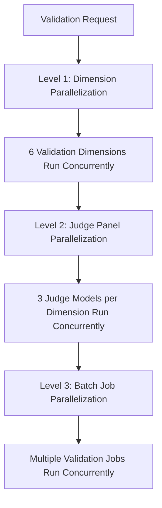

# Parallel LLM Validation Documentation

## Overview

The Parallel LLM Validation system is a high-performance validation framework that provides faster validation processing through intelligent parallelization of LLM-based compliance validation. This system validates expense processing results across multiple dimensions using concurrent judge panels.


## Architecture Overview

### Three-Level Parallelization

The system implements parallelization at three distinct levels:



#### Level 1: Dimension Parallelization
- **6 Validation Dimensions** processed simultaneously
- Each dimension validates a specific aspect of compliance
- No inter-dimension dependencies

#### Level 2: Judge Panel Parallelization
- **3 Judge Models** per dimension run concurrently
- Uses different Bedrock LLM models for consensus
- Implements uncertainty quantification principles

#### Level 3: Batch Job Parallelization
- **Multiple validation jobs** processed simultaneously
- Configurable concurrency limits
- Efficient resource utilization

### Validation Dimensions

The system validates across 6 independent dimensions:

1. **FACTUAL_GROUNDING** - Validates facts against source data
2. **KNOWLEDGE_BASE_ADHERENCE** - Checks compliance rule application
3. **COMPLIANCE_ACCURACY** - Validates compliance determinations
4. **ISSUE_CATEGORIZATION** - Assesses issue identification quality
5. **RECOMMENDATION_VALIDITY** - Evaluates recommendation usefulness
6. **HALLUCINATION_DETECTION** - Detects fabricated information

## Performance Benefits


## Configuration

### Environment Variables

Add these variables to your `.env` file:

```bash
# Enable/disable parallel validation
PARALLEL_VALIDATION_ENABLED=true

# Concurrency settings
VALIDATION_DIMENSION_CONCURRENCY=6    # Max concurrent dimensions
VALIDATION_JUDGE_CONCURRENCY=3        # Max concurrent judges per dimension
VALIDATION_JOB_CONCURRENCY=5          # Max concurrent batch jobs

# Rate limiting
BEDROCK_RATE_LIMIT_PER_SECOND=10      # AWS Bedrock API rate limit

# Fallback behavior
VALIDATION_FALLBACK_TO_SEQUENTIAL=true # Auto-fallback on errors
```


## Implementation Details

### Core Components

#### ParallelExpenseComplianceUQLMValidator

The main validator class that orchestrates parallel validation:

```typescript
class ParallelExpenseComplianceUQLMValidator {
  // Main parallel validation method
  async validateComplianceResponseParallel(
    aiResponse: string,
    country: string,
    receiptType: string,
    icp: string,
    complianceJson: any,
    extractedJson: any
  ): Promise<ValidationSummary>

  // Batch processing method
  async validateBatchJobsInParallel(
    jobs: ValidationJob[]
  ): Promise<BatchValidationResult>
}
```

#### Service Integration

The parallel validator is automatically integrated into the expense processing pipeline:

```typescript
// ExpenseProcessingService automatically selects validator type
const useParallelValidation = process.env.PARALLEL_VALIDATION_ENABLED !== 'false';

if (useParallelValidation) {
  this.complianceValidator = new ParallelExpenseComplianceUQLMValidator();
} else {
  this.complianceValidator = new ExpenseComplianceUQLMValidator(this.logger);
}
```

### Concurrency Control

The system uses the `p-limit` utility for intelligent concurrency management:

```typescript
import pLimit from '../utils/p-limit';

// Dimension-level concurrency control
const dimensionLimit = pLimit(this.config.dimensionConcurrency);

// Judge-level concurrency control  
const judgeLimit = pLimit(this.config.judgeConcurrency);

// Rate limiting for API calls
const rateLimiter = pLimit(this.config.rateLimitPerSecond);
```

### Error Handling & Resilience

#### Graceful Degradation
- Automatic fallback to sequential processing on errors
- Partial failure handling - continues with successful validations
- Minimum success criteria (50% of dimensions must succeed)

#### Error Recovery
```typescript
try {
  // Attempt parallel validation
  result = await this.validateDimensionsInParallel(dimensions);
} catch (error) {
  if (this.config.fallbackToSequential) {
    // Fallback to sequential processing
    result = await this.validateDimensionsSequentially(dimensions);
  } else {
    throw error;
  }
}
```

## Usage Guide

### Basic Usage

```typescript
import { ParallelExpenseComplianceUQLMValidator } from './src/utils/judge/validation';

// Initialize the validator
const validator = new ParallelExpenseComplianceUQLMValidator();

// Validate a single compliance response
const result = await validator.validateComplianceResponse(
  aiResponse,
  country,
  receiptType,
  icp,
  complianceData,
  extractedData
);

console.log(`Validation completed in ${result.performance_metrics?.execution_mode} mode`);
console.log(`Speedup: ${result.performance_metrics?.speedup_factor}x`);
```

### Batch Processing

```typescript
// Prepare validation jobs
const jobs: ValidationJob[] = [
  {
    id: 'job1',
    aiResponse: response1,
    country: 'germany',
    receiptType: 'meal',
    icp: 'icp1',
    complianceData: compliance1,
    extractedData: extracted1
  },
  // ... more jobs
];

// Process batch
const batchResult = await validator.validateBatchJobsInParallel(jobs);

console.log(`Processed ${batchResult.successful_validations}/${batchResult.total_jobs} jobs`);
console.log(`Total time: ${batchResult.total_time_seconds}s`);
```

### Integration with Existing Pipeline

The parallel validator integrates seamlessly with the existing expense processing pipeline:

```typescript
// No code changes required - automatic integration
const result = await expenseProcessingService.processExpenseDocument(
  markdownContent,
  filename,
  imagePath,
  country,
  icp,
  complianceData,
  expenseSchema
);

// Check if parallel validation was used
const validationInfo = result.timing?.agent_performance?.llm_validation;
console.log(`Validation mode: ${validationInfo?.execution_mode}`);
console.log(`Validator type: ${validationInfo?.validator_type}`);
```

## Monitoring & Debugging

### Debug Logging

The system provides comprehensive debug logging to monitor parallel execution:

```
🚀 Initializing PARALLEL LLM-as-judge compliance validator...
✅ PARALLEL LLM-as-judge compliance validator initialized successfully
📊 Parallel Configuration:
   - Dimension Concurrency: 6
   - Judge Concurrency: 3
   - Rate Limit: 10 req/sec

🔍 Phase 5: LLM-as-Judge Validation
📊 Validator Type: ParallelExpenseComplianceUQLMValidator
⚡ Parallel Processing: ENABLED
🚀 STARTING PARALLEL LLM VALIDATION
📈 Configuration:
   - Dimension Concurrency: 6
   - Judge Concurrency: 3
   - Rate Limit: 10 req/sec
⏱️ Starting validation execution...
📊 Validation completed in 15.23s (parallel mode)
⚡ Speedup: 3.2x faster
✅ LLM-as-judge validation completed in 15.23s (parallel mode)
```

### Performance Metrics

The system tracks detailed performance metrics:

```typescript
interface PerformanceMetrics {
  execution_mode: 'parallel' | 'sequential' | 'hybrid';
  total_time_seconds: string;
  speedup_factor?: string;
  time_saved_seconds?: string;
  dimension_timings?: {
    [dimension: string]: {
      duration_seconds: string;
      execution_mode: string;
      judge_count: number;
    };
  };
  concurrent_operations: number;
  success_rate: number;
}
```

### Health Monitoring

Monitor system health through the validation service:

```typescript
// Check validator health
const health = await expenseProcessingService.healthCheck();
console.log(`LLM Validation Available: ${health.agents.llmValidation}`);

// Get performance statistics
const stats = await validator.getPerformanceStats();
console.log(`Average speedup: ${stats.averageSpeedupFactor}x`);
console.log(`Success rate: ${stats.successRate}%`);
```

## Troubleshooting

### Common Issues

#### 1. Parallel Validation Not Working

**Symptoms:**
- Logs show "ExpenseComplianceUQLMValidator" instead of "ParallelExpenseComplianceUQLMValidator"
- No speedup metrics in results
- Sequential execution mode

**Solutions:**
```bash
# Check environment variable
echo $PARALLEL_VALIDATION_ENABLED

# Ensure it's set to true
export PARALLEL_VALIDATION_ENABLED=true

# Restart the application
```

#### 2. AWS Bedrock Rate Limiting

**Symptoms:**
- Throttling errors in logs
- Validation failures
- Slower than expected performance

**Solutions:**
```bash
# Reduce rate limit
BEDROCK_RATE_LIMIT_PER_SECOND=5

# Reduce concurrency
VALIDATION_DIMENSION_CONCURRENCY=3
VALIDATION_JUDGE_CONCURRENCY=2
```

#### 3. Memory Issues

**Symptoms:**
- Out of memory errors
- System slowdown
- Process crashes

**Solutions:**
```bash
# Reduce batch concurrency
VALIDATION_JOB_CONCURRENCY=3

# Enable fallback
VALIDATION_FALLBACK_TO_SEQUENTIAL=true
```

#### 4. Inconsistent Results

**Symptoms:**
- Different validation scores between runs
- Partial validation failures

**Solutions:**
- Check network connectivity to AWS Bedrock
- Verify AWS credentials and permissions
- Review rate limiting settings


`

### Types

#### ValidationSummary

```typescript
interface ValidationSummary {
  overall_score: number;
  overall_reliability: 'high' | 'medium' | 'low';
  dimension_scores: {
    [dimension: string]: {
      score: number;
      reliability: string;
      judge_consensus: number;
    };
  };
  performance_metrics?: PerformanceMetrics;
  metadata: {
    judge_models: string[];
    processing_time_ms: number;
    execution_mode: string;
  };
}
```

#### ValidationJob

```typescript
interface ValidationJob {
  id: string;
  aiResponse: string;
  country: string;
  receiptType: string;
  icp: string;
  complianceData: any;
  extractedData: any;
}
```

#### BatchValidationResult

```typescript
interface BatchValidationResult {
  total_jobs: number;
  successful_validations: number;
  failed_validations: number;
  total_time_seconds: number;
  average_time_per_job: number;
  results: ValidationSummary[];
  performance_summary: {
    speedup_factor: number;
    time_saved_seconds: number;
    concurrent_jobs: number;
  };
}
```

