# Country Policy Data Management and Processing Pipeline
## Complete Technical Architecture Guide

Based on the factory/spec/base.md architecture principles, here's the comprehensive technical guide for the Country Policy Data Management and Processing Pipeline shown in your diagram:

## System Overview

The Country Policy Data Management and Processing Pipeline is a **web scraping and policy management system** that automatically collects, processes, and maintains country-specific expense compliance policies. The system follows the event-driven architecture patterns established in the main Expenses AI system.

## Architecture Components

### 1. **Data Ingestion Layer**

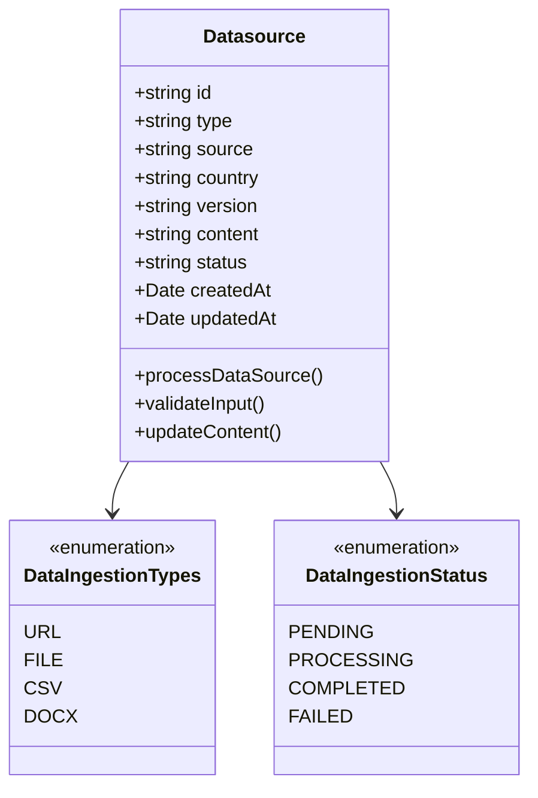

**Supported Input Types:**
- **URLs**: Web pages containing policy information
- **Files**: CSV, DOCX documents with structured policy data
- **Direct Content**: Manually entered policy rules and compliance data

### 2. **Scraping Engine Architecture**

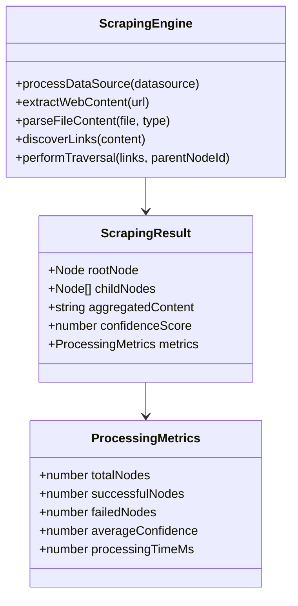

### 3. **Node Hierarchy Management**

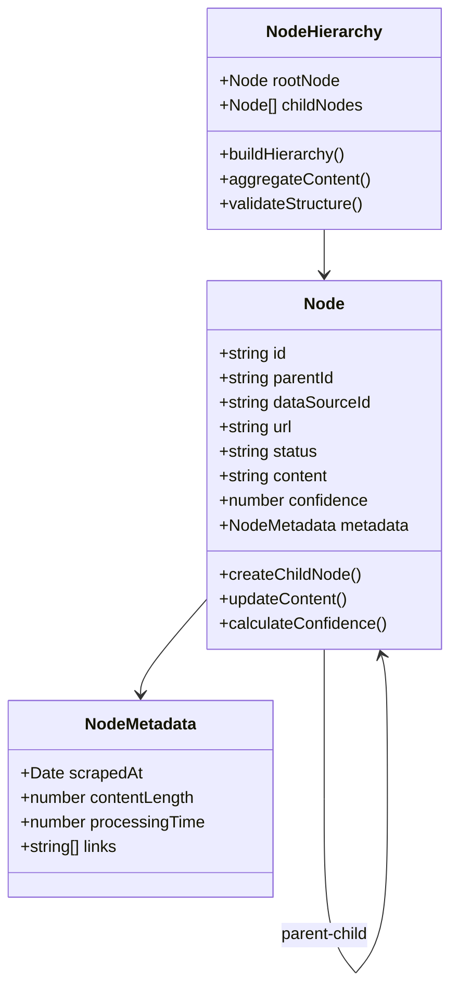

## Processing Pipeline Flow

### **Stage 1: Initial Scraping**
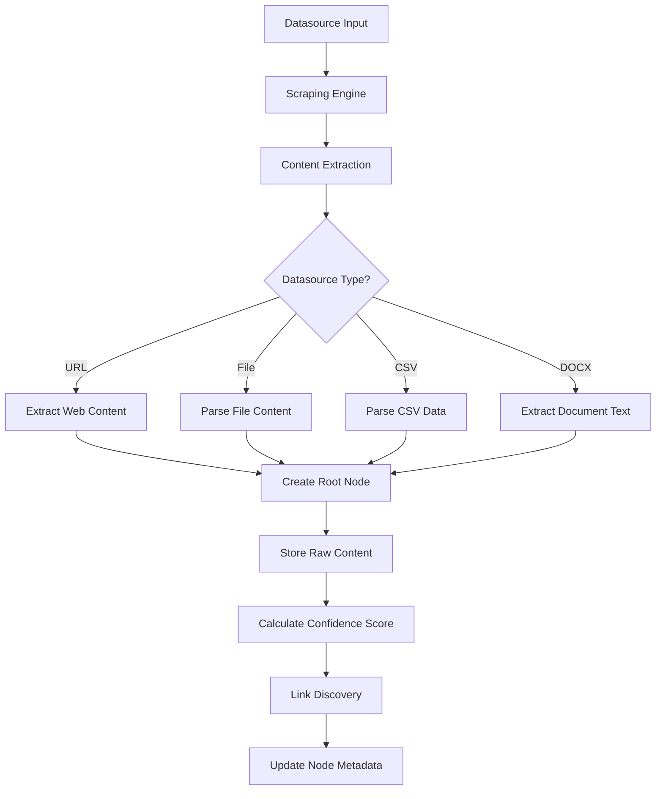

### **Stage 2: Conditional Traversal**
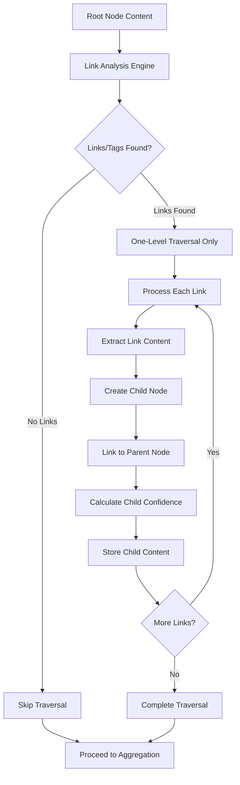

### **Stage 3: Content Aggregation**
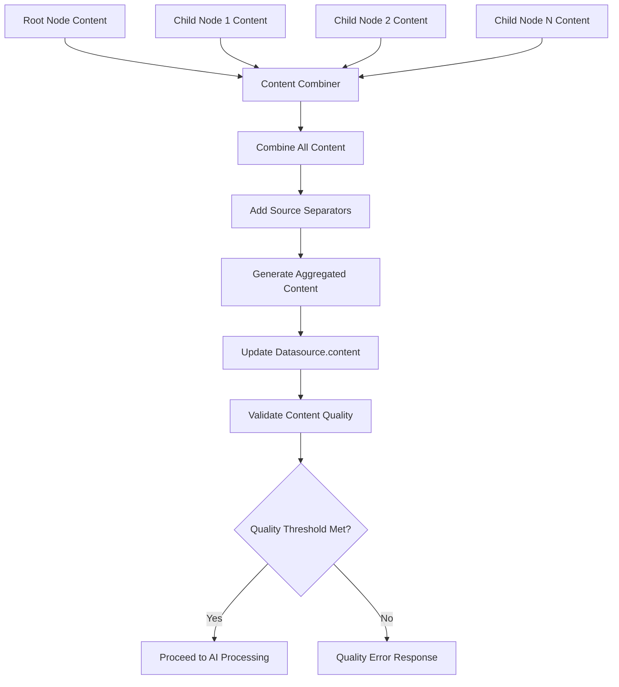

### **Stage 4: AI Processing**
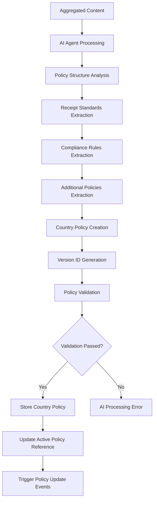

## Database Schema Design

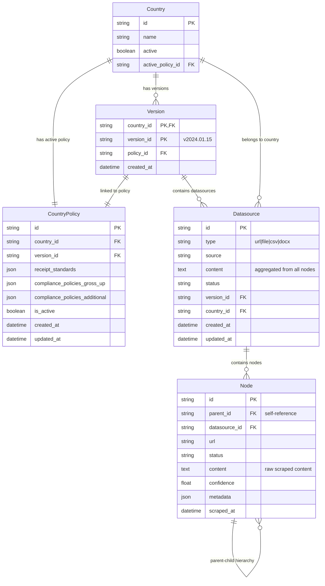

### **Queue Architecture Flow**

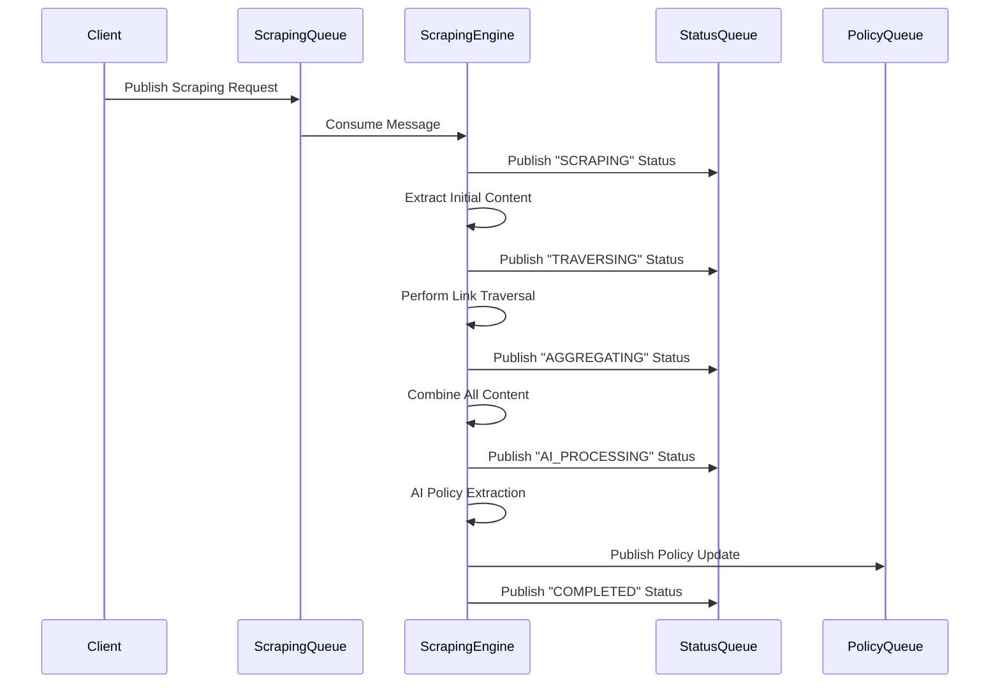

### **Error Handling Strategy**

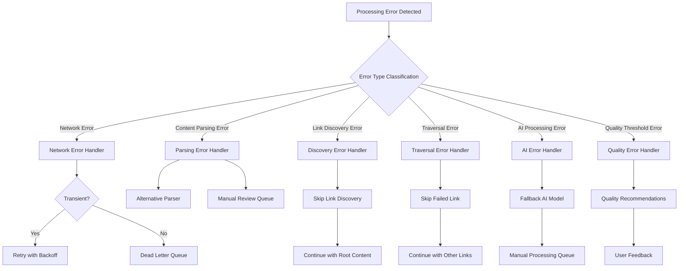

## Integration with Main System

### **Policy Integration Flow**

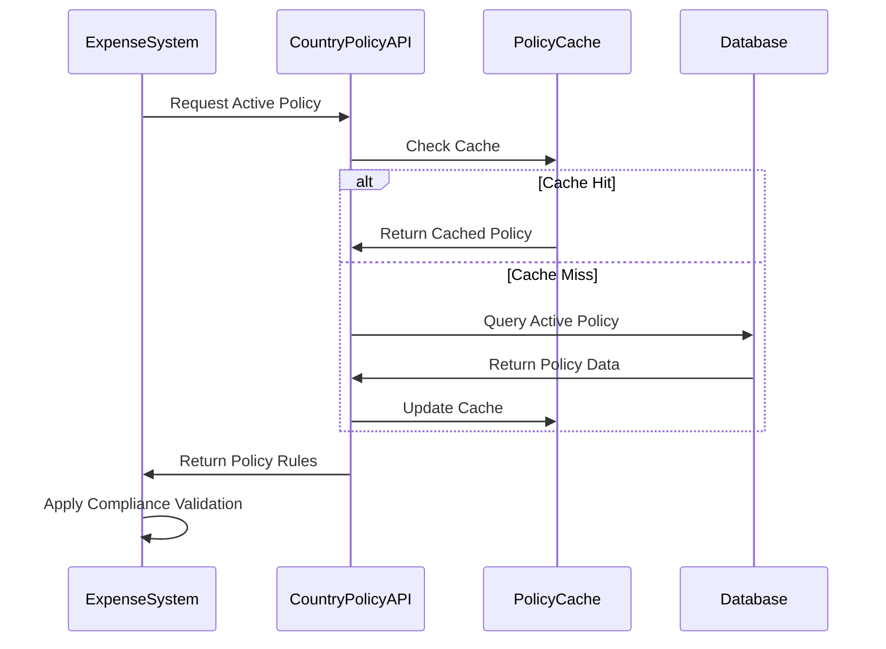

### **Version Management System**

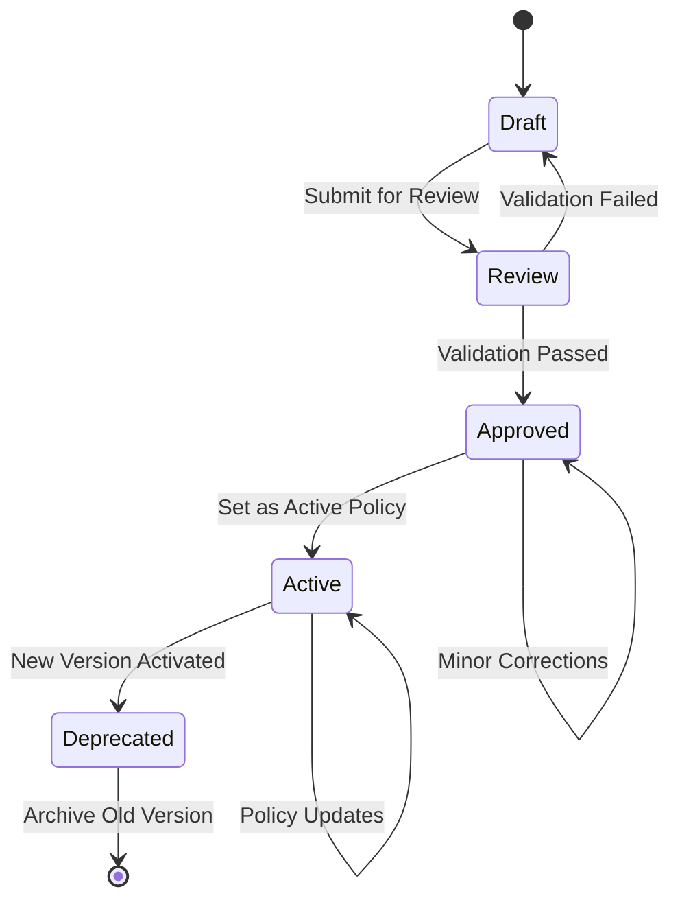

### **Real-time Policy Updates**

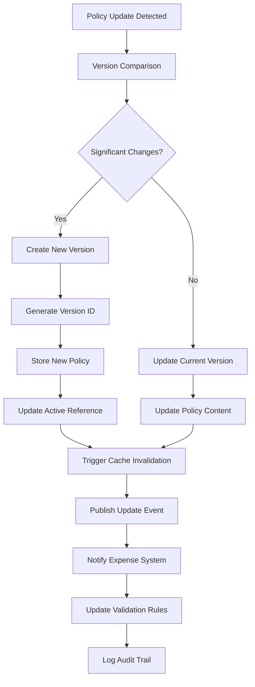

## Conclusion

This Country Policy Data Management and Processing Pipeline provides a robust foundation for automatically maintaining up-to-date country-specific compliance policies. The design emphasizes:

1. **Event-Driven Architecture**: Complete RabbitMQ-based message processing
2. **Intelligent Scraping**: Advanced one-level traversal with quality validation
3. **Hierarchical Data Management**: Clear parent-child node relationships
4. **Content Aggregation**: Comprehensive data collection from multiple sources
5. **AI-Powered Processing**: Automated policy extraction and structuring
6. **Version Control**: Complete audit trail with policy versioning
7. **Quality Assurance**: Comprehensive validation and error handling
8. **Scalability**: Horizontal scaling with queue-based processing

The architecture ensures that expense processing systems always have access to current, accurate country policies while maintaining full traceability and automated updates.
